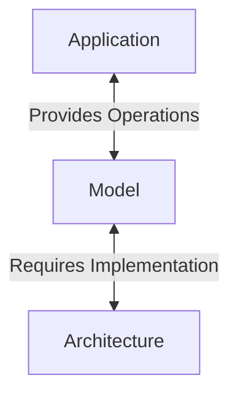
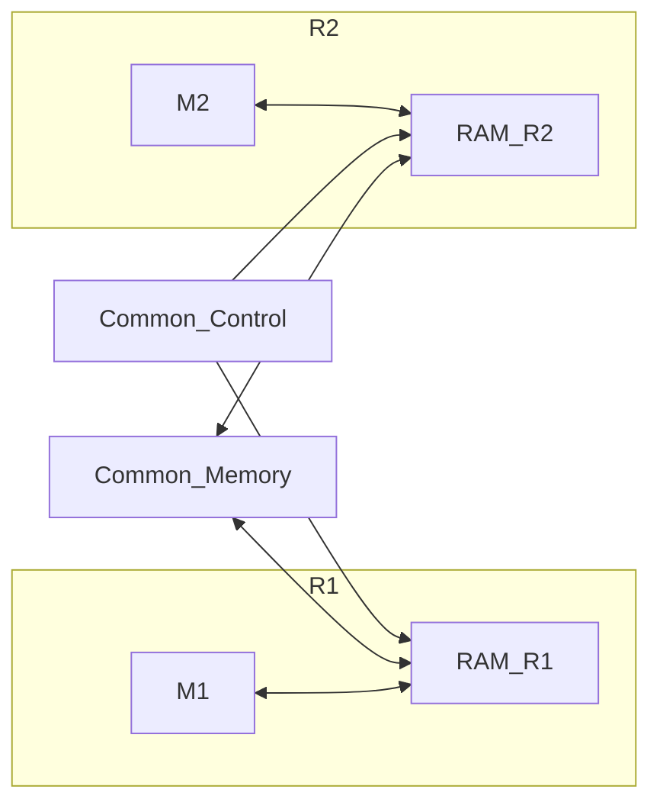

---
tags:
  - PRL
aliases:
  - PRAM
sources:
  - "[[PRL_05_PRAM.pdf]]"
---
A model is an interface that divides the application layer from the architecture, which PRAM is. 

## Definition
A parallel random access machine is a **synchronous model of parallel computation**, where [[Parallel Communication|parallel communication]] is done through shared memory. The basic model contains:
- [[Microprocessor|Processors]] (amount is $p$)
	- Additive (logic) operations
	- Multiplicative operations
	- Conditioned jumps
	- Addressing
- [[Random Access Memory|RAM]]
	- Unlimited cap
	- Unlimited length of word (not commonly used or advised)
	- Memory is controlled by one program

PRAM is an alternative model to parallel [[Turing Machine|Turing machine]]. A calculation occurs in several *synchronous steps*, which are:
1. Reading from shared memory
2. Local operation
3. Writing into shared memory

Processors can during one step do several operations and can use their own index (unique number of the processor).
### Theorem
Each problem that can be solved with a PRAM with $p$ processors in $t$ steps is also solvable with $p'<p$ processors in time $O(t\times p/p')$.
### Limitations
The limitations of this model are based on the limitations of [[Parallel Communication#Shared memory|shared memory]]. With **CRWC** architecture there are writing conflicts that can be resolved with:
- **COMMON**: all values that are being written have to be the same
- **ARBITRARY**: all values that are being written can be different and one of them at random can be chosen
- **PRIORITY**: processors have constant (non changing) priority and the value that is being written by a processor with the highest priority gets chosen
With these in place it applies that:
$$\text{PRIORITY}\geq\text{ARBITRARY}\geq\text{COMMON}\geq \text{CREW PRAM} \geq\text{EREW PRAM}$$