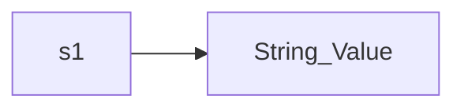
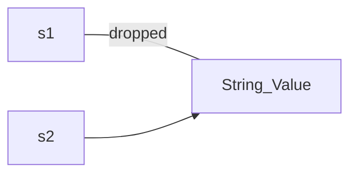
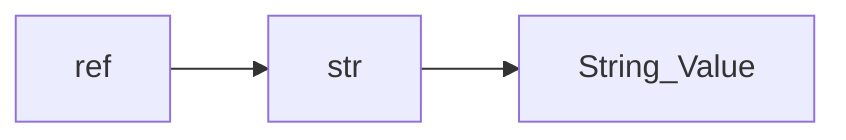

---
tags:
  - FLP
aliases:
  - rust
sources:
  - "[[FLP_03_Rust.pdf]]"
---
A [[Lifetime Programming|lifetime programming]] language that shares a strong familiarity with [[Haskell]]. It uses the concepts such as *Ownership* and *Lifetime* from this paradigm to make sure that all memory and data are safe at all time and there is no chance of segmentation fault or other memory errors commonly found in [[Imperative Programming|imperative programming]] languages such as C, C++ and C#. 
## Basics
Some basic information:
### Variable
A variable is created through the `let` keyword, such as in `let a = 5`, but this is only a constant. Within Rust you must declare that a variable is mutable like `let mut a = 5`.
You can also implicitly declare what type a variable will be like `let mut a: u32 = 5`.
### Shadowing
We can overshadow variables from higher scopes, such in the example: 
```
fn main() {  
	let x = 1;  
	println!("{}", x); // 1  
	{  
		let x = 2; // "zakryje" vnejsi x  
		println!("{}", x); // 2  
	}  
	println!("{}", x); // znovu 1  
}  
```
## Ownership
Ownership is concept that uses a [[Set|set]] of rules that must be obeyed and if these are not followed then the program won't compile. In other words it limits ways by which we can reference and change data. This allows Rust to have no [[Garbage Collector]]. From the Rust citation:
	Ownership is Rust’s most unique feature and has deep implications for the rest of the language. It enables Rust to make memory safety guarantees without needing a garbage collector, so it’s important to understand how ownership works. …
The basic ideas ownership takes into account are:
- [[Stack]] is a simple [[FIFO]] structure and the operations *push/pop* are simple and fast
- [[Heap]] is a "random" access with operations *allocation* of space of a certain size and the program must find it.
- **Data locality** means that data close together can be processed faster than jumping from one address to completely different one.
- **Program stack** uses program to store data, pointers to heap, necessary information to make the program run.
#### Rules
The basic rules are:
- Each value in has an owner.
- There can only be one owner at a time.
- When the owner goes out of scope, the value will be dropped.
### Rust Examples
An example of ownership work can be:
```
{ // s is not valid here
let s = "hello"; // s is valid from this point forward

// do stuff with s

} // the scope is over and s is no longer valid
```
A simple example with numbers is:
```
let x = 5;
let y = x + 1; // copy of x, which is 5 (simple value)
```
This gets more complicated with complex data types:
```
let s1 = String::from("hello");
let s2 = s1;
```
In the example above, the `s2` is also a copy, but only of the "value" (the structure) and the `s1` is no longer valid and is dropped. In the next two graphs the data relation is visible:


The variables `s1` and `s2` are only envelope structures that hold the pointer to the values, the length and the capacity. The actual values are stored in a separate unseen variable.
This means ones the variable `s2` takes over the `String_Value` variable (because anything can have only one owner), the variable `s1` is dropped as it no longer has access to the variables.
Another example of this the other way around is:
```
let mut s = String::from("hello");
s = String::from("ahoy");
println!("{s}, world!");
```
This writes out `ahoy, world!` as the original value within `s` is rewritten and thus the original string value `hello` is dropped as nothing refers to it. This behavior can be overridden by creating a deep copy through the `.clone()` method that not only copies the envelope structure, but also the referenced value (creating two identical values).
### References
References to a value do not take ownership, but they are only pointer to the variable. Creating a reference (pointer) is called **borrowing**. As the pointer is of a known size, it can be dropped without affecting the original value. An example of this can be:

There are both **immutable** and **mutable** reference. There can also be only one mutable reference in charge. We can also have as many immutable reference, but they cannot be combined with mutable ones. A reference is valid till its last use, thus a mutable reference can be created after the last use of all immutable reference without an issue.
A reference also cannot be dangling, such as: 
```
fn main() { 
	let reference_to_nothing = dangle(); 
} 
fn dangle() -> &String { 
	let s = String::from("hello"); 
	&s 
} 
```
In the example above a variable and a reference is created within the scope of a function and only the reference is returned. This reference would be pointing to an non-existing object, so this won't compile. A way to solve this is to just return the variable itself, as in:
```
fn no_dangle() -> String { 
	let s = String::from("hello"); 
	s 
}
```
### Borrow
In Rust we can borrow a value through creating of a reference, so that we don't exchange the ownership of a value and then loose it once the scope of a function is over. This can be seen in:
```
fn print_length(s: &String) {  
	println!("{}", s.len());  
}  
 
fn main() {  
	let name = String::from("Petr Pavel");  
	print_length(&name);  
	 
	println!("{}", name);  
}
```
If we would not include the `&` then the ownership of `name` would change and we would not get it back from the the function.
## Slices
A slice lets you reference a contiguous sequence of elements in a collection rather than the whole collection. A slice is a kind of *reference*, so it does not have ownership. A simple way to create String slices is:
```
let s = String::from("hello world"); 

let hello = &s[0..5]; \\ points to only "hello"
let world = &s[6..11]; \\ points to only "world"
```
## Data Structures
Data structures are tuples, just as in [[Haskell]]. They use "deriving" as well and an example of a data structure can be:
```
[#deriving(Debug)]
struct Rectangle {
	width: u32,
	height: u32,
}

fn main() {
	let scale = 2;
	let rect1 = Rectangle{
		width: dbg!(30 * scale),
		height: 50,
	}
	dbg!(&rect1)
}
```
We can also create method that work over these data structures, such as:
```
impl Rectangle {
	fn area($self) -> u32 {
		self.width * self.height
	}
	
	fn can_hold($self, other: Rectangle) -> bool {
		self.width > other.width && self.height > other.height
	}
}
```
We can also use multiple `impl` block to separate the implementations.
## Enum
Enums in Rust have a simple, but also powerful implementations:
```
enum IpAddrKind{
	V4,
	V6,
}

let four = IpAddrKind::V4;
```
We can expand this with types and internal values:
```
enum IpAddrKind{
	V4(u8, u8, u8, u8),
	V6(String),
}

let four = IpAddrKind::V4(String:from(127, 0, 0, 1));
let six = IpAddrKind::V4(String:from("::1"));
```
In many ways these are similar to [[Haskell]] data variants.
### Option Enum
The Rust equivalent to the [[Haskell]] Maybe type.
```
enum Option<T> {
	None,
	Some(T),
}
```
### Pattern Matching
Both normal and option enum can be used in pattern matching. This is done through `match`, such as:
```
match add {
	IpAddrKing::V4(a, b, c, d) => a + b + c + d,
	IpAddrKing::V6(i) => i,
}
```
Important is that you must provide all cased unlike in Haskell. If we want a default case we can use the key symbol `_` to define it.
## Lifetime
A lifetime is a *segment of time* in which a *value in memory* is *valid* and it is safe to work with it. Some basic ideas are:
- Local variables live till the end of scope.
- A value on the [[Heap]] lives while its owner is alive.
- A reference cannot outlive the original.
- Rust statically checks lifetimes through something called a *borrow checker*. 
### Reference
Within Rust the lifetime of references is signified within the function signature, which can be:
- `&i32` a reference
- `&'a i32` a reference with an explicit lifetime
- `&'a mut i32` a mutable reference with an explicit lifetime
### Lifetime Annotation
A lifetime annotation is a syntactic label holding information for the [[Compiler|compiler]], that describes the relation between reference lifetimes.  For example we can be a function signature: 
```
fn longest<'a>(x: &'a str, y: &'a str) -> &'a str { 
	if x.len() > y.len() { x } else { y } 
}
```
What this tells Rust is:
- That for some lifetime `'a`, the function takes two parameters, both of which are string slices that live at least as long as `'a`.
- The string slice returned from the function will live at least as long as lifetime `'a`.
- In practice, it means that the lifetime of the reference returned by the longest function is the same as the smaller of the lifetime of the values referred to by the function arguments.
- These relationships are what we want Rust to use when analyzing this code.
- In other words, when returning a reference from a function, the lifetime parameter for the return type needs to match the lifetime parameter for one of the parameters.
- In the reference returned does not refer to one of the parameters, it must refer to a value created within this function. However, this would be a dangling reference because the value will go out of scope at the end of the function.